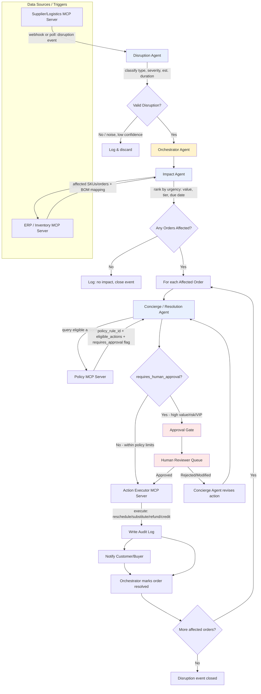

# Agentic SupplySync — Technical Workflow, Design Discussion & Deployment Notes
### Compiled working notes: workflow diagram → industry generalization → client prerequisites → RAG policy design → hackathon mock setup → Gemini Enterprise deployment

---

## 1. Detailed Technical Workflow



### Step-by-step explanation

**1. Trigger — Disruption Agent.** An event arrives from the Supplier/Logistics MCP server (webhook or poll). The Disruption Agent classifies type, severity, and estimated duration. Low-confidence/noise events are logged and dropped — a first self-correction checkpoint.

**2. Orchestrator hands off to Impact Agent.** The Orchestrator owns overall workflow state and passes the validated `DisruptionEvent` to the Impact Agent, which queries the ERP/Inventory MCP server (using the Bill-of-Materials mapping) to find every order that depends on the affected material/SKU. If nothing is affected, the event closes with a log entry.

**3. Per-order resolution loop.** For each affected order, the Concierge/Resolution Agent queries the Policy MCP server, which returns eligible actions plus a `policy_rule_id` — the agent never invents a resolution, only acts on what policy explicitly returns.

**4. The approval fork — core governance checkpoint.** If policy marks the action as within auto-approval limits, the Concierge Agent calls the Action Executor MCP server directly — action executes, gets logged, customer/buyer notified. If policy flags it high-risk (high value, VIP/strategic buyer, costly recovery), it routes to the **Approval Gate** — a human reviewer sees the recommendation with full context and approves (executes normally) or rejects/modifies (sent back to Concierge Agent to revise).

**5. Loop and close.** The Orchestrator repeats the per-order loop for every affected order, then marks the disruption event closed once all are resolved.

---

## 2. Does the Same Flow Work Across Industries?

The **structure never changes** — Disruption Agent → Impact Agent → Concierge Agent → Approval Gate loop. What changes per industry is **what plugs into each node**: the data source, what "affected" means, and what the policy rulebook says.

| Flow Step | D2C Fashion | Pharmacy (TrueMeds-style) | B2B Textile Manufacturing |
|---|---|---|---|
| **Disruption Agent listens to** | WMS stock levels + manufacturing supplier ETA feed | Pharmacy inventory system + distributor/manufacturer supply feed | ERP raw material inventory + supplier delay reports |
| **What counts as a "disruption"** | Fabric/dye delay, stockout of a SKU/color/size | Medicine batch shortage, distributor delay | Raw material (fabric, dye, thread) delay or shortage |
| **Impact Agent queries** | OMS (order → SKU mapping) | OMS + prescription/customer health profile | Sales Order system + BOM mapping (raw material → buyer order) |
| **What "affected order" means** | Customer orders containing that SKU/color, not yet shipped | Customer orders needing that exact medicine, prioritized by chronic/critical flag | Buyer purchase orders whose BOM depends on the delayed material |
| **Policy MCP returns** | Substitution rules, refund tiers by delay/value | Formulary rules (approved same-salt alternates) — pharmacist-maintained | Contract terms: penalty clauses, partial-shipment allowance, pre-approved alternate suppliers |
| **Auto-approved actions** | Notify + reschedule; substitute if low-cost | Notify + substitute only for common, low-risk medicines | Notify + minor reschedule within contract SLA |
| **Always escalates to human** | Full refund, high-value/loyal customer | Any prescription-drug substitution — hard rule, no exceptions | Rush-sourcing that costs extra, or any strategic/high-value buyer |
| **Who's in the Approval Gate** | Support/CX lead | Licensed pharmacist | Procurement/account manager |

**Key point for the pitch:** the agent code and orchestration logic don't change — only the MCP server implementations (different systems behind the same tool interface) and the policy data each Policy MCP server returns. *"Swap the MCP servers and the policy rulebook, and the same four-agent pattern works in a completely different industry."*

**Nuance worth flagging:** pharmacy has a hard-coded escalation rule (prescription substitutions always go to a human, no policy override) rather than a value-based threshold like the other two — a good detail showing you've thought about where a threshold isn't enough and a hard compliance rule is needed.

### What makes a problem fit this pattern at all

A business problem fits the four-agent skeleton when it has all of:
1. Something upstream can go wrong (supply, capacity, availability) that the business doesn't fully control
2. That disruption silently affects downstream commitments already promised to someone
3. There's a real rulebook (policy, contract, SLA) that determines the correct response — not a free-form judgment call
4. Some responses are low-risk/routine (safe to automate) and some are high-stakes (need a human)

### Additional industries validated against this shape

- **Airlines/Travel** — flight delay/cancellation → affected passengers → rebooking/compensation policy (e.g., EU261-style rules) → auto-rebook vs. escalate for cancellations/VIP/group bookings
- **Healthcare Appointment/Resource Scheduling** — doctor/equipment unavailable → affected patients → urgency-based rescheduling policy → hard-rule escalation for urgent/critical patients
- **Banking/Insurance Claims** — partner service outage → stuck applications → alternate verification/compensation policy → escalate high-value or regulatory-sensitive cases
- **Construction/Project-based Manufacturing** — critical material delayed → affected project milestones → contract penalty/substitute-material policy → escalate anything hitting a penalty clause or critical path
- **SaaS/Cloud Infra (internal ops)** — third-party API/vendor outage → degraded customer accounts → SLA credit policy → escalate enterprise customers with contractual SLA credits

### Where the pattern breaks down

- **No real policy layer** — if the "right response" is a pure judgment call with no consistent rule, there's nothing for the Policy MCP to return; you're really building a notification system, not an agentic one.
- **Everything is either trivial or always needs a human** — no meaningful auto-safe middle tier makes the Approval Gate pointless.
- **No structured link between disruption and affected commitment** — the BOM-mapping problem (see Section 3). If nothing connects "this upstream thing" to "this downstream commitment," the Impact Agent has nothing to query — this data gap has to be solved before the agent can exist.

---

## 3. Client Readiness — Prerequisite Systems

If evaluating whether a client can actually use this agent, walk through three tiers:

### Hard requirements (agent can't function without these)
1. **System of record for "what's coming in"** (Watcher's data source) — ERP, WMS, or even a diligently maintained inventory spreadsheet; must be digital and current.
2. **System of record for "what's been promised"** (Matcher's data source) — OMS, sales order system, booking system.
3. **A traceable link between the two** — the most commonly missing piece. For manufacturing this is a Bill of Materials; for pharmacy, SKU-to-order mapping; for airlines, flight-to-passenger manifest. Without this link, the agent cannot connect a disruption to an affected order — this must be solved before the agent, not by the agent (see Section 4 for the RAG-based fallback when this is missing).
4. **Written-down rules for what to do** (the Policy layer) — refund tiers, substitution rules, contract penalty terms, escalation thresholds. If the honest answer is "we decide case by case," that's a gap to close first.
5. **A place for humans to actually respond** — an existing queue/inbox/ticketing system the agent can write into, not a brand-new tool nobody checks.

### Needed for full value (agent works, but weaker without these)
6. **API or webhook access** to the above systems — without it, the agent becomes a scheduled batch process instead of a real-time responder.
7. **Customer/order prioritization data** — tier, value, urgency flags — needed to intelligently split auto-resolve vs. escalate.
8. **Existing notification infrastructure** — email/SMS/app-push already in place.

### Nice to have
9. Historical disruption/resolution data — helps tune thresholds and catch edge cases.
10. Structured contract data (B2B) — if contracts are PDFs with no structured terms, someone has to extract penalty clauses/SLAs first.

### Client readiness framing
- **"Ready today"** — all of 1–5 digitized and linked (mature e-commerce/pharmacy platforms often qualify).
- **"Ready with a short data project first"** — has the systems (1, 2, 5) but the link (3) or the policy (4) isn't formalized. This describes most mid-size manufacturers, and is a legitimate, sellable first engagement on its own.
- **"Not ready"** — no digital system of record at all for supply or orders. Digitization is the right first investment, not the agent.

---

## 4. When the BOM/Structured Link Is Missing — RAG-Based Fallback

### The mechanism
When there's no structured link between raw material/supplier item and customer order, bridge it using the **product catalog** as the connective layer:
1. **Product catalog as anchor** — even unsophisticated businesses usually have a catalog (name, description, materials, specs).
2. **Disruption description → embedding** — embed the disruption event text (e.g., "Dye Batch #4521, Pantone Navy 19-4052, cotton-poly blend delayed").
3. **Similarity search against the catalog** — RAG-style retrieval to find which products reference that material/attribute with high similarity.
4. **Products → orders** — once the affected products are known, mapping to open orders is usually the easy part.

Chain becomes: **Disruption → (RAG similarity) → Affected Products → (simple lookup) → Affected Orders**, instead of a direct BOM lookup.

### Investor-lens risk assessment
- **Upside:** turns "client must have a mature BOM system" from a hard blocker into a soft dependency — widens addressable market significantly, and is a genuine differentiator ("we handle messy, unstructured client data").
- **Risk — false positive/negative rate:** a BOM lookup is deterministic; a similarity match is probabilistic. A false positive means needless compensation (costs money); a false negative means a real disruption goes undetected (worse). Be honest this trades certainty for coverage.
- **Mitigation — confidence-gated escalation:** only auto-act on high-confidence matches (e.g., >90% similarity); anything below threshold **always** escalates to a human, independent of order value. This is a second, independent escalation trigger beyond just "is this expensive."
- **Is this permanent or a bridge?** Frame it as a confidence-scored bridge, not a replacement. Every human-confirmed match (correct or corrected) becomes training/reference data and incrementally builds the structured link the client never had — a genuine moat: the longer a client uses the system, the less they need the fallback.
- **Unit economics:** RAG/similarity search costs more compute than a database join — not a hackathon blocker, but a fair diligence question for a real product.

### Recommended tiered design
- **Tier 1 (ideal):** structured BOM/SKU link exists → deterministic lookup, high trust, can auto-act more freely.
- **Tier 2 (fallback):** no structured link → RAG/embedding similarity → confidence-scored match → low-confidence matches always escalate, regardless of order value.
- **Tier 3 (incremental improvement):** every human-confirmed Tier 2 match gets logged as a candidate structured mapping, shrinking the client's BOM gap over time.

---

## 5. Structured Rules vs. RAG for Policy — Which Should Be the Default?

### Why pure RAG-as-decision-maker is risky
RAG is good at "find me the relevant passage," not naturally good at "give me a reliable yes/no on whether to refund $2,000." Letting the LLM freely decide the action from a retrieved paragraph reopens the exact hallucination risk the `policy_rule_id` guardrail was built to prevent.

### The practical hybrid approach
1. **RAG for retrieval, not decision-making** — store policy documents (contract text, refund T&Cs, SOPs) as chunked, embedded text; retrieve the top-matching clause(s) for the situation.
2. **Structured extraction with mandatory citation** — the LLM extracts eligible actions and approval requirements from the retrieved text and must cite the exact clause (a source chunk ID) it used — same pattern as `policy_rule_id`, just sourced from unstructured text. If it can't point to a specific supporting clause, it can't take the action.
3. **Confidence-gated escalation** — RAG-derived decisions carry retrieval uncertainty, unlike deterministic numeric rules:
   - High retrieval confidence + unambiguous clause → can auto-act.
   - Low confidence, ambiguous clause, or no clear match → **always escalates**, regardless of dollar value. A second, independent escalation trigger alongside order value and customer tier.

### Which should be the default — the realistic answer
Most real companies (outside large, heavily systemized platforms) don't have clean structured policy tables — policy lives in contracts, shared docs, or institutional memory ("ask Priya, she's been here 12 years"). Even mature companies with structured rules usually only cover ~80% of common cases; the remaining 20% (special contracts, negotiated terms, legacy exceptions) still lives in documents.

**Conclusion: RAG-based retrieval should be the primary path, with structured rules treated as an optimization used when it exists** — not the reverse.

- The Policy MCP server's real job: given a situation, retrieve the best-matching policy text and return a structured decision + citation + confidence score, regardless of whether the source was a database row or a PDF paragraph. The Concierge Agent shouldn't know or care which.
- Structured tables become a **caching/fast-path layer**: once a RAG-retrieved decision is confirmed correct enough times (or a human explicitly codifies it), promote it into a fast, deterministic rule — mirrors the same "fallback builds structure over time" idea from Section 4.
- **Pitch framing:** *"Because most real clients don't have clean rules, and we designed for that reality from day one instead of assuming an ideal system."* This doubles as a Discovery answer and an Architecture answer.

---

## 6. Hackathon Mock System Setup

Since there's no real client system to connect to, mock each of the 5 systems to reflect real enterprise access patterns.

### 6.1 Mock ERP — Raw Material Inventory
*Real-world equivalent: SAP/Oracle inventory module.* Build as a SQLite/Postgres table + thin API wrapper.
```
raw_materials
├── material_id (e.g., "DYE-NAVY-4052")
├── material_name
├── stock_qty
├── reorder_threshold
├── supplier_id
├── expected_restock_date
└── status ("available" | "delayed" | "shortage")
```
Seed 15–20 materials, most "available," 2–3 pre-flagged "delayed" as demo triggers.

### 6.2 Mock Supplier/Logistics Feed
*Real-world equivalent: EDI feed or supplier portal.* An event log table you insert into live during the demo.
```
disruption_events
├── event_id
├── material_id (links to raw_materials)
├── event_type ("shortage" | "shipment_delay" | "quality_hold")
├── severity ("low" | "medium" | "high")
├── estimated_duration_days
├── reported_at
└── status ("new" | "processed")
```

### 6.3 Mock OMS + BOM Mapping
*Real-world equivalent: Sales order system + Bill of Materials.* Two linked tables.
```
products
├── product_id
├── product_name
├── material_ids_used (join table → material_id)

orders
├── order_id
├── buyer_name
├── product_id (links to products)
├── quantity
├── order_value
├── promised_delivery_date
├── buyer_tier ("standard" | "strategic")
└── status
```
Seed 10–15 orders across 5–6 products so one material delay realistically affects 2–3 orders. Add a `product_description` text field + a small vector store (Chroma/FAISS) here to demo the Tier 2 RAG fallback from Section 4.

### 6.4 Mock Policy/Contract Rules
*Real-world equivalent: Contract management system.* Given Section 5's conclusion, this should primarily be **short policy/contract text snippets** (a paragraph each) run through RAG retrieval + citation + confidence gating — not a clean rules table. Seed 4–5 snippets covering the demo's order scenarios (auto-reschedule, auto-partial-refund, escalate, and one deliberately ambiguous case to show correct escalation).

### 6.5 Mock Approval Queue + Audit Log
*Real-world equivalent: Internal ticketing tool + Cloud Logging.* Two tables plus a minimal approval UI (even a basic HTML page with Approve/Reject) — worth actually building since "human clicks approve live" is a strong demo moment.
```
approval_queue
├── queue_id
├── order_id
├── recommended_action
├── policy_rule_id / source_chunk_id
├── status ("pending" | "approved" | "rejected")

audit_log
├── log_id
├── order_id
├── action_taken
├── policy_rule_id / source_chunk_id
├── event_id
└── timestamp
```

### Practical build stack
- **Database:** SQLite (zero setup, file-based)
- **API layer:** FastAPI wrapping each table's CRUD as MCP tool endpoints
- **Seed data:** `faker` for realistic filler; hand-craft the 3–4 demo-critical rows precisely
- **RAG layer:** Chroma DB (lightweight, in-memory-friendly)
- **Approval UI:** single-page HTML form is enough

### Framing for judges
State explicitly in docs/deck: *"These are reference implementations of the MCP tool interfaces — in production, `raw_materials` becomes a live SAP/ERP connector, `disruption_events` becomes a real EDI/webhook feed. The agent logic and MCP schema don't change, only the data source behind them."*

### Build sequencing
Policy rules → OMS/BOM → ERP inventory → Supplier feed → Approval queue. The agent logic depends on policy and order data existing first; the disruption feed is just an event inserted last, once everything downstream is ready to react.

---

## 7. Gemini Enterprise Deployment — User-Facing vs. Background Agents

### The two-tier deployment model

**Background/autonomous tier — Disruption Agent, Impact Agent, Concierge Agent.** These don't need a chat window. Gemini Enterprise Agent Platform supports **Batch & Event-driven agents** that trigger off events in BigQuery or Pub/Sub rather than a user typing something — no user interaction required for the happy path.

**User-facing tier — the Orchestrator (queryable) + the Approval Gate.** Two distinct entry points:
1. **Approval Gate surfaces proactively** — pushed into where people already work (Google Chat, Gmail, or the Gemini Enterprise app) via native Workspace integration, as a card/notification with recommended action, context, and an Approve/Reject action.
2. **Orchestrator Agent published to the Agent Gallery** — a queryable "front door." Publish it as a custom agent (via Agent Studio or ADK) so an ops/procurement person can open the app and ask "what's the status of the navy dress order disruption?" or "show me pending approvals." The Orchestrator owns workflow state and answers from it.

### How the user knows background work is happening — three layers
- **Passive/proactive:** approval cards and status notifications pushed into Chat/Gmail/the Gemini Enterprise app when something needs attention or completes.
- **On-demand/conversational:** the published Orchestrator Agent answers status questions directly in chat.
- **Admin/audit layer:** Agent Platform's built-in observability (logs, metrics, traces) gives reviewers/admins a dashboard view of everything background agents have done.

### The two starting points
- **System-initiated:** the Disruption Agent's event trigger (Pub/Sub message or BigQuery row insert simulating the mock Supplier/Logistics feed) — no human involved until/unless escalation happens.
- **Human-initiated:** a user opening the Gemini Enterprise app and talking to the published Orchestrator Agent.

**Demo suggestion:** show both in the video — trigger the event (background start), then cut to the Gemini Enterprise app to show the approval card appearing and the Orchestrator answering a status question (human-facing start).

---

## 8. "I Never Open Gemini Enterprise" — Delivery & Identity Verification

### The core issue
The Gemini Enterprise **app** can't push anything to a user who hasn't opened it — it's not a notification service on its own. The app is where you go to *act* on something once already notified elsewhere; it isn't the notification surface itself.

### Delivery — reach the user where they already are
The agent posts the notification through channels with their own push systems: **Google Chat** (interactive cards, native mobile/desktop/browser push, same as any Chat message from a person) or **Gmail** (lands in the inbox, uses existing email notification settings). Example message: *"Disruption detected: Navy dye batch delayed 7 days. Affects Order #4521 (200 units, Buyer: XYZ Corp). Recommended action: partial shipment + 5-day extension per Clause 4.2. [Approve] [Reject] [View details]"* — with Approve/Reject embedded directly in the message.

### Identity/Verification — two valid approaches

**Approach 1 — Buttons act immediately, identity comes from the channel.**
If delivered via Slack/Google Chat, the platform already knows who the user is (already logged in) — clicking Approve carries the authenticated identity automatically via the interactive component's callback. Lowest friction; best for a hackathon demo.

**Approach 2 — Secure link with a one-time token.**
For plain email (less interactive than Chat/Slack cards), Approve/Reject are links containing a unique, single-use, time-limited token tied to that specific approval request. Clicking opens a minimal web page ("Approve resolution for Order #4521?") — no login required, since the token itself proves the recipient is the intended one (same pattern as a password-reset email link). The system logs the token, timestamp, and action taken.

**What matters for this use case:** since real financial/business decisions are involved (refunds, contract commitments), the audit log should clearly show *who* approved *what*, not just *that* something was approved — even in Approach 1, log the actual user identity (email/Workspace ID) from the platform's auth, not just "someone clicked approve."

### Practical hackathon build (no real Slack/Gmail API needed)
1. Mock a webhook that posts a message to a Slack/Discord channel (stands in for "wherever ops actually works").
2. Include a link with a token in the URL, pointing to a simple approval webpage.
3. On click, call the Action Executor MCP tool and write to the audit log, mapping the token to a seeded mock "approver identity."
4. Demo it live: disruption triggers → Slack message appears → click Approve in the link → audit log updates in real time.

This is a stronger demo moment than showing the Gemini Enterprise app itself — it proves the system reaches the human where they live, not where the platform assumes they'll be.

---

## 9. Open Items / Not Yet Finalized

- Real ROI numbers for the business case (still placeholder in the main architecture doc)
- Team certification status against Gemini Enterprise certification path (20% of score — fully controllable, should be locked in early)
- Whether to build real Google Chat/Gmail integration vs. the Slack/webhook mock for the demo (time-permitting decision)
- Final choice of demo vertical for the live walkthrough (B2B Textile recommended as primary, per earlier discussion)
